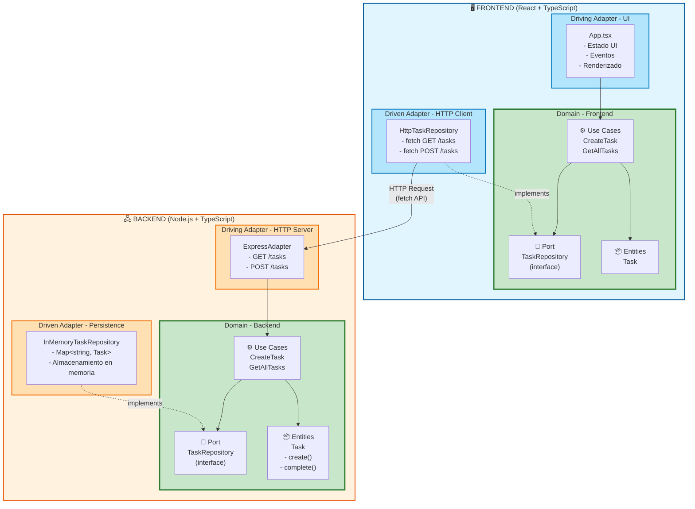
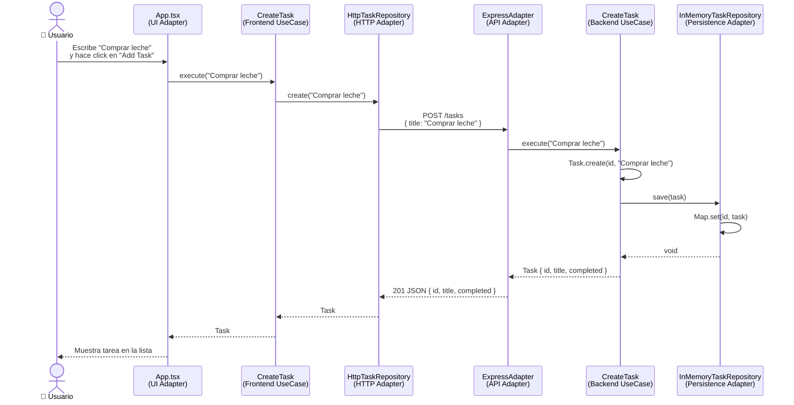

# Arquitectura Hexagonal - Diagrama y Decisiones

## Diagrama de Componentes



## Flujo de Datos Completo



## Explicación de las Capas

### 🎯 Domain (Núcleo - Verde)

**Responsabilidad**: Contiene la lógica de negocio pura e independiente de tecnología.

**Componentes**:
- **Entities**: `Task` - Objeto del dominio con reglas de negocio
- **Use Cases**: `CreateTask`, `GetAllTasks` - Casos de uso de la aplicación
- **Ports**: `TaskRepository` - Interfaces que definen contratos

**Regla de Oro**: Esta capa NO conoce nada del mundo exterior (frameworks, librerías, HTTP, React, etc.)

**Duplicación Frontend/Backend**: El dominio está duplicado porque cada aplicación evoluciona independientemente. En un monorepo empresarial, podrías tener:
```
packages/
  ├── domain-shared/    # Dominio compartido
  ├── frontend/
  └── backend/
```

### 🔵 Driving Adapters (Adaptadores Primarios - Azul Claro)

**Responsabilidad**: Inician las acciones en el sistema. Son los puntos de entrada.

**Frontend**: `App.tsx`
- Captura eventos del usuario (clicks, formularios)
- Gestiona estado de UI (useState, useEffect)
- Traduce interacciones en llamadas a use cases
- Renderiza con React (framework específico)

**Backend**: `ExpressAdapter`
- Recibe peticiones HTTP
- Parsea requests (JSON, query params)
- Llama a use cases correspondientes
- Formatea respuestas HTTP

**Por qué son Adapters**: Adaptan protocolos externos (UI events, HTTP) al lenguaje del dominio.

### 🟠 Driven Adapters (Adaptadores Secundarios - Naranja)

**Responsabilidad**: Responden a peticiones del dominio. Implementan los ports.

**Frontend**: `HttpTaskRepository`
- Implementa el port `TaskRepository`
- Usa `fetch` para comunicarse con el backend
- Transforma JSON en entidades del dominio

**Backend**: `InMemoryTaskRepository`
- Implementa el port `TaskRepository`
- Usa `Map<string, Task>` para almacenar datos
- Podría reemplazarse por `PostgresTaskRepository` sin cambiar el dominio

**Por qué son Adapters**: Adaptan tecnologías específicas (HTTP, DB) a las interfaces del dominio.

## Decisiones Arquitectónicas

### 1. ✅ Inversión de Dependencias

```
Dominio define → Port (interface)
                    ↑
                    | implementa
                    |
Adapter → implementa la interface
```

**Beneficio**: El dominio no depende de los adapters. Puedes cambiar la implementación sin tocar la lógica de negocio.

### 2. ✅ Dependency Injection Manual

**Frontend** (`App.tsx`):
```typescript
const taskRepository = new HttpTaskRepository('http://localhost:3000');
const createTaskUseCase = new CreateTask(taskRepository);
```

**Backend** (`index.ts`):
```typescript
const taskRepository = new InMemoryTaskRepository();
const createTask = new CreateTask(taskRepository);
const httpAdapter = new ExpressAdapter(createTask, getAllTasks);
```

**Beneficio**: Fácil de testear. Puedes inyectar mocks en los tests.

### 3. ✅ Separation of Concerns

Cada componente tiene una única responsabilidad:
- **Entities**: Reglas de negocio
- **Use Cases**: Orquestación de la lógica
- **Ports**: Contratos
- **Adapters**: Detalles de implementación

### 4. ✅ Framework Independence

El dominio no importa:
- ❌ `express`
- ❌ `react`
- ❌ `fetch`
- ✅ Solo TypeScript puro

**Beneficio**: Puedes migrar de Express a Fastify, o React a Vue sin tocar el dominio.

### 5. ✅ Simplicidad para Aprendizaje

Para mantener el ejemplo educativo:
- Sin base de datos real → `InMemoryTaskRepository`
- Sin autenticación/autorización
- Sin DTOs (Data Transfer Objects)
- Sin validaciones complejas
- Sin manejo exhaustivo de errores

## Comparación con Arquitecturas Tradicionales

### ❌ Arquitectura en Capas Tradicional
```
UI → Controller → Service → Repository → DB
     (Acoplamiento vertical - cambiar DB afecta todo)
```

### ✅ Arquitectura Hexagonal
```
      Driving Adapters (UI, HTTP)
              ↓
           DOMAIN
              ↓
      Driven Adapters (DB, APIs)

(Puedes cambiar adapters sin afectar el dominio)
```

## Cómo Extender la Arquitectura

### Agregar nuevo Use Case

1. Crea el use case en `domain/useCases/CompleteTask.ts`
2. Usa el port existente `TaskRepository`
3. Actualiza los adapters para exponer el nuevo caso de uso

### Cambiar de InMemory a PostgreSQL

1. Crea `PostgresTaskRepository.ts` en `adapters/repositories/`
2. Implementa la interface `TaskRepository`
3. Cambia la inyección en `index.ts`:
```typescript
// Antes
const taskRepository = new InMemoryTaskRepository();

// Después
const taskRepository = new PostgresTaskRepository(connectionString);
```

✅ **Sin tocar el dominio ni los use cases**

### Agregar GraphQL además de REST

1. Crea `GraphQLAdapter.ts` en `adapters/http/`
2. Usa los mismos use cases existentes
3. Ambos adapters (Express y GraphQL) usan el mismo dominio

## Testing en Arquitectura Hexagonal

```typescript
// Test del Use Case (sin necesidad de HTTP ni DB)
describe('CreateTask', () => {
  it('should create a task', async () => {
    const mockRepo: TaskRepository = {
      save: jest.fn(),
      findAll: jest.fn(),
      findById: jest.fn()
    };

    const useCase = new CreateTask(mockRepo);
    const task = await useCase.execute('Test task');

    expect(mockRepo.save).toHaveBeenCalledWith(task);
  });
});
```

**Ventaja**: Tests rápidos, sin dependencias externas.

## Recursos Adicionales

- [Hexagonal Architecture - Alistair Cockburn](https://alistair.cockburn.us/hexagonal-architecture/)
- [Clean Architecture - Robert C. Martin](https://blog.cleancoder.com/uncle-bob/2012/08/13/the-clean-architecture.html)
- [Ports and Adapters Pattern](https://herbertograca.com/2017/11/16/explicit-architecture-01-ddd-hexagonal-onion-clean-cqrs-how-i-put-it-all-together/)
